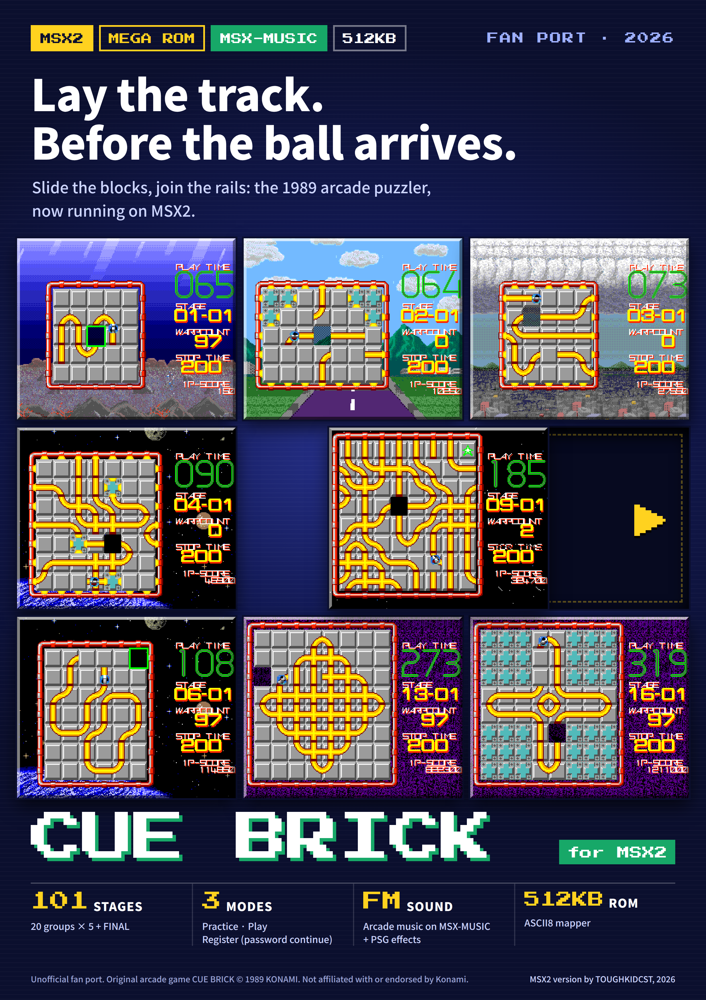
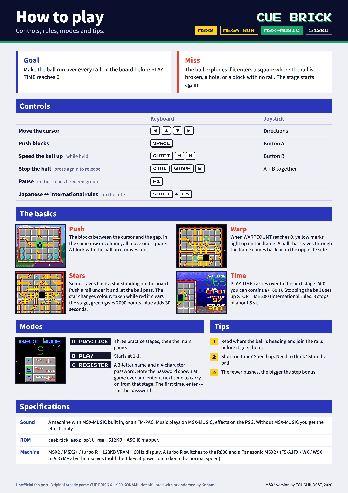
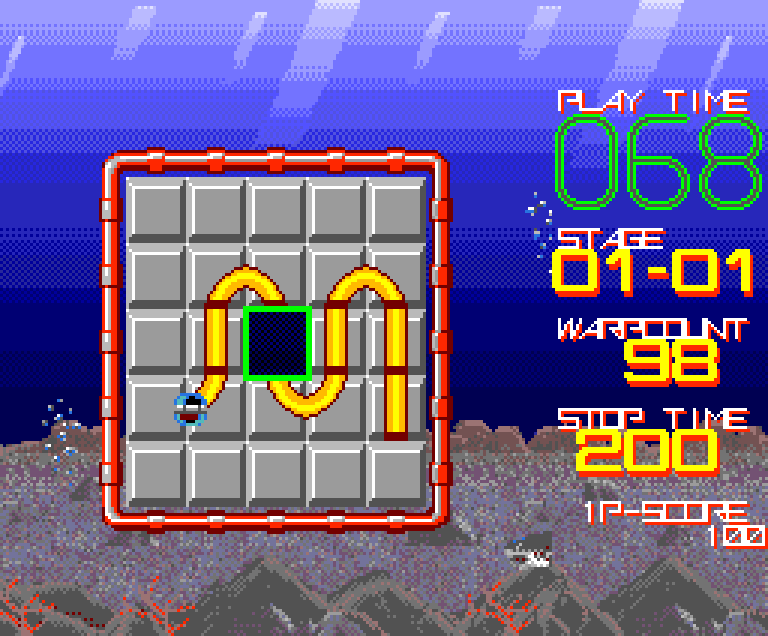
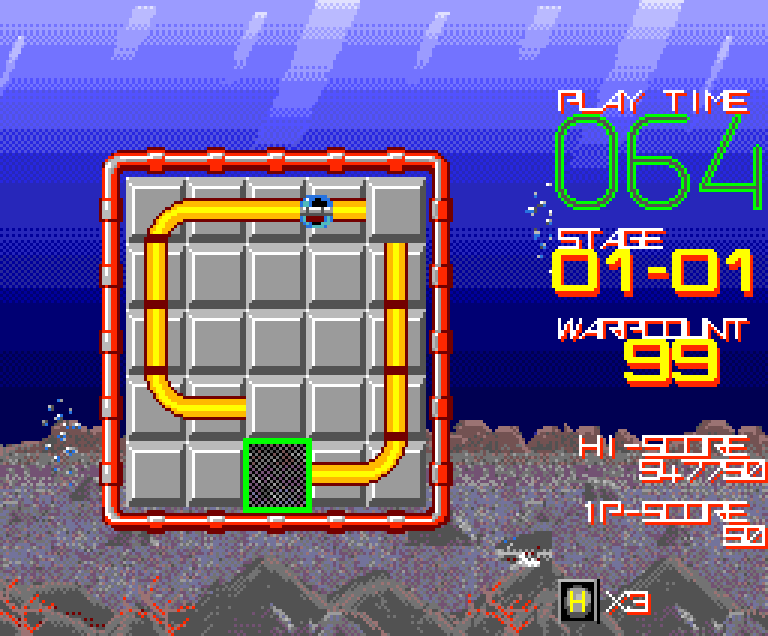
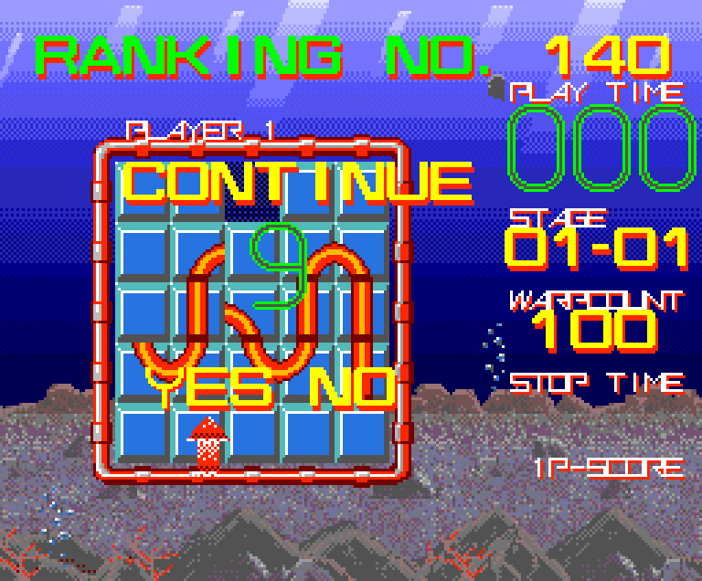
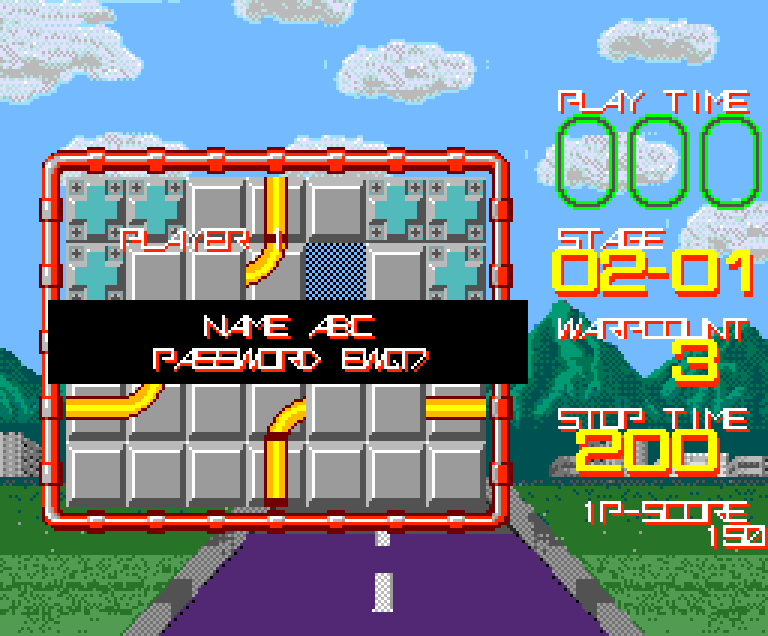

# Cue Brick for MSX2 — User Manual (MSX-MUSIC)

2026-10-05 · ToughkidCST

## About this game

Cue Brick is a puzzle game: slide the blocks to join the rails so that the ball runs over every rail on the board. This ROM is an unofficial fan port of the 1989 arcade game to MSX2.

This manual covers the **MSX-MUSIC 512KB edition** (`cuebrick_msx2_opll.rom`).

- 101 stages: 20 groups × 5 stages + FINAL
- Three modes: practice, play, and register (continue with a password)
- Music on MSX-MUSIC (FM), sound effects on the PSG
- Everything fits in one 512KB ROM, so it also runs on flash cartridges that support only up to 512KB

Original arcade game CUE BRICK © 1989 KONAMI. This MSX2 version is not affiliated with Konami.

## Requirements and the ROM

Runs on MSX2, MSX2+ and turbo R. It needs 128KB of VRAM and a display that accepts 60Hz.

| Item | Details |
| --- | --- |
| ROM file | `cuebrick_msx2_opll.rom` |
| Size | 512KB (64 banks of 8KB) |
| Mapper | ASCII8 |
| Music | MSX-MUSIC — built in, or an FM-PAC |
| Sound effects | The computer's PSG |

Without MSX-MUSIC you get sound effects only, with no music. The game itself plays the same.

## Running the game

Load the ROM on a flash cartridge or in an emulator, set the mapper to **ASCII8**, and the game starts.

- If your flash cartridge or emulator cannot pick the mapper automatically, select ASCII8 by hand.
- Machines with built-in MSX-MUSIC (MSX2+, turbo R and others) play the music as they are.
- On an MSX2 without built-in MSX-MUSIC, plug an FM-PAC into another slot.

At power-on the game checks the machine and switches the CPU to its fastest mode: R800 on a turbo R, 5.37MHz on a Panasonic MSX2+ (FS-A1FX / WX / WSX). The game speed stays the same; only the time needed to prepare each screen gets shorter. Hold the **1** key at power-on to keep the CPU as it is.

## Starting a game and the modes

After power-on the logo appears, then the title screen. Press **SPACE** (or joystick button A) to go to the SELECT MODE screen. Leave the title alone for about 10 seconds and a play demo and a space scene take turns; press SPACE during them to return to the title.

### SELECT MODE

The cursor starts on B. Choose with up and down, confirm with SPACE. If the number on screen counts down from 9 to 0, the game starts in the mode under the cursor.

| Mode | What it does |
| --- | --- |
| A PRACTICE | Three practice stages (00-01 to 00-03). PLAY TIME is 30 seconds, and a miss restarts the same stage. When you clear all three or time runs out, the intro scene plays and the main game starts at 1-1. |
| B PLAY | The intro scene plays, then the game starts at 1-1. |
| C REGISTER | Enter a name and a password, then start. You can go on from the stage where you stopped last time. See “Register mode, passwords, continue and game over”. |

### Japanese rules and international rules

The Japanese and international arcade versions differ in puzzles and rules. This port contains both and starts with the Japanese rules. Press **SHIFT+F5** on the title screen to switch to the international rules: INT appears at the top left and the logo turns orange. Press it again to go back to the Japanese rules.

|  | Japanese (default) | International (INT) |
| --- | --- | --- |
| Puzzles | Japanese layouts | International layouts |
| Stopping the ball | STOP TIME 200. It drains only while the ball is stopped | HALT, 3 times. About 5 seconds each |
| Continue after time over | HELP — shows the solution of the stage, then the same stage starts over | Play goes on from where it stopped |
| Retrying after a miss | The board colour changes: grey → blue → yellow | The colour does not change |
| Star items | Japanese positions (from group 1) | From group 3 |
| On-screen display | STOP TIME | HI-SCORE, \[H\]×times left |

## Controls

The keyboard and a joystick (port 1) work at the same time.

| Action | Keyboard | Joystick |
| --- | --- | --- |
| Move the cursor | Cursor keys | Directions |
| Push blocks / confirm | SPACE | Button A |
| Speed the ball up (while held) | SHIFT, M, N | Button B |
| Stop the ball | CTRL, GRAPH, B, or SPACE together with M, N or SHIFT | Buttons A+B |
| Pause | F1 (only in the scene between groups) | — |
| Switch rules (Japanese ↔ international) | SHIFT+F5 (only on the title screen) | — |
| Choose YES / NO on the continue screen | Left and right cursor keys, SPACE to confirm | Left and right, button A |

With the Japanese rules, each press of the stop control toggles between stopped and moving. With the international rules, one press stops the ball for about 5 seconds.

## Reading the screen

The puzzle board is on the left and the information display on the right. The board holds blocks with rails drawn on them and one empty square (the hole); the ball rolls along the rails.

| Display | Meaning |
| --- | --- |
| PLAY TIME | Time left, in seconds. It carries over from stage to stage, and a little is added at the start of each stage. |
| STAGE | Group number - stage number. 01-01 is the first stage of group 1. |
| WARPCOUNT | Goes down by 1 each time the ball passes a square. At 0 the warp opens. |
| STOP TIME | How much longer you can keep the ball stopped (Japanese rules). |
| 1P-SCORE | Your score. |

With the international rules (INT), HI-SCORE appears in place of STOP TIME, and below it \[H\]×number shows how many HALTs are left.

The blinking green frame on the board is the cursor, and the dark square is the hole.

## Rules

### Clearing and missing

You clear a stage when the ball has **passed over every rail on the board once**. Rails disappear as the ball passes over them. The stage is cleared the moment the ball passes the last piece of rail, so it does not matter if the ball then rolls into a dead end.

It is a miss when the ball enters any of these:

- a square where the rail does not connect
- the hole
- a block with no rail

On a miss the ball explodes and the stage starts over. The board and WARPCOUNT go back to their starting state and the ball becomes one step slower, but PLAY TIME is not given back.

### Pushing blocks

Put the cursor on a block and press SPACE: **every block in the same line** between the cursor block and the hole moves one square towards the hole. The cursor must be in the same row or column as the hole. You can also push a block the ball is riding on, and the ball moves with it. The teal plates are fixed walls and do not move.

### Warp

When WARPCOUNT reaches 0, yellow marks appear on the board frame and the fixed walls. From then on, a ball that leaves through the frame or a fixed wall comes back in from the opposite side of the same line. It is a miss if the square it comes into has no connecting rail, and it is also a miss to leave through the frame while WARPCOUNT is still above 0.

### Time

PLAY TIME starts at 60 seconds, and at the start of each stage time is added according to the length of that stage's rails. Time left carries over to the next stage. A warning sounds below 10 seconds, and at 0 TIME OVER appears, followed by the continue screen.

### Score

| Item | Points |
| --- | --- |
| Each time the ball enters a square | 50 |
| Step bonus (on clearing) | Stage number × steps left × 100. Each push uses up one step, so fewer pushes mean a bigger bonus |
| Time bonus (on clearing) | Time left × 100 |

### Star items

In some stages a star floats over one square of the board. The star is not a block; it stays fixed in that position. Push a rail block under it and let the ball pass through that square to collect it. The star keeps changing colour, and **its colour at the moment the ball touches it** decides the prize.

| Colour | Prize |
| --- | --- |
| Red | BONUS CLEAR — all remaining rails are erased and the stage is cleared at once |
| Green | BONUS 2000 — 2000 points |
| Blue | TIME +30 — 30 seconds added to PLAY TIME |

Red shows only very briefly, and green lasts the longest.

## Register mode, passwords, continue and game over

### Continue

When PLAY TIME reaches 0, TIME OVER appears, followed by the continue screen. RANKING NO. at the top is a rank based on the stage you have reached.

Choose YES or NO with left and right, and confirm with SPACE.

- **YES**: you get 60 seconds of PLAY TIME and go on. STOP TIME (HALT × 3 with the international rules) is refilled too. There is no limit on the number of continues.
- **NO**, or not choosing before the number counts down from 9 to 0, is GAME OVER.

With the Japanese rules, **HELP** plays before you choose YES or NO. It shows the cursor moves and block pushes that solve the stage, without the ball. If you choose YES, the same stage starts over.

### Register mode (C REGISTER)

Enter a 3-character name and a 4-character password. Pick letters on the letter grid with the cursor keys and enter them with SPACE; `<` deletes one character.

1. **The first time**: enter a name and `----` as the password. NEW PLAYER appears and the game starts at 1-1.
2. **At game over**: your name and the password for the stage you were on appear on screen. Write them down.
3. **Next time**: enter the same name and that password. OK - CONTINUE appears and you go on from that stage. The score starts at 0 and PLAY TIME at 60 seconds.

Good to know:

- A password belongs to its name. With a different name the same password gives PASSWORD ERROR, and you enter the four password characters again.
- The cartridge cannot save anything. Without the password written down you cannot continue.
- Passwords from the MSX-MUSIC 1MB edition and the SCC edition work as they are.
- After 30 seconds on the register screen the game starts at 1-1 without registering.
- Press **M** or **N** on the register screen to skip registration and start at 1-1 right away.

### Game over

PLAYER 1 / GAME OVER is shown for about 5 seconds, then the game returns to the title. After about 1 second you can skip it with SPACE. If you registered, your name and password appear after it.

## Stages, the scene between groups, and pause

### Stages

The main game has **20 groups × 5 stages + FINAL = 101 stages**. In the STAGE display the first number is the group and the second is the stage within that group. When you clear a stage, the step bonus and time bonus are counted, and blocks fly in to form the next board.

There are six backgrounds, depending on the group: sea, mountains and city, clouds, space and Earth, deep space, and a purple tunnel. Sharks, rays and bubbles pass by in the sea, and a spaceship in space. In the 512KB edition, loading one picture when the background or scene changes takes 0.4–0.8 seconds (at the standard CPU speed).

### The scene between groups

When you clear all five stages of a group, a short scene with a moai plays, with the words STAGE CLEAR / CHALLENGE / NEXT STAGE, and then the next group begins. Clearing FINAL leads to the ending.

### Pause

Press **F1** during the scene between groups to pause the game. A short jingle plays and a white PAUSE blinks in the middle of the screen; press F1 again to go on.

There is no pause while you are solving a puzzle. If you need to step away, finish the stage and pause in the scene between groups. If you need a moment to think during play, stop the ball (STOP TIME / HALT). PLAY TIME keeps running while the ball is stopped.

## Tips

- **Read the route first.** See which square the ball will leave into, and join the next rail before it gets there.
- **Do not push the block the ball is about to enter.** The ball cannot enter a block that is moving, and that is a miss. While blocks are moving, the next push is not accepted either.
- **Pushing the block the ball is on moves the ball.** When the rail is about to end, you can carry the ball to another place this way.
- **Short on time? Speed up. Need time to think? Stop.** Once all the rails are joined, holding the speed-up control helps both the time bonus and the time you carry into the next stage.
- **Fewer pushes mean a bigger step bonus.** The multiplier also grows in later groups.
- **Count on the warp.** Once WARPCOUNT is 0 you can join rails across the frame to the opposite side, which opens up boards that look like dead ends.
- **Watch the star's colour before going in.** Go for blue (TIME +30) when time is short, and for red (BONUS CLEAR) on a hard stage. You can stop the ball to get the timing right.
- **Stuck? Watch HELP.** With the Japanese rules, the solution of the stage is shown when time runs out.
- **New to the game? Start with A PRACTICE.** Three stages to learn pushing, speeding up and stopping, and then the main game follows.

## Troubleshooting

| Symptom | What to check |
| --- | --- |
| No picture, it stops after the logo, or the graphics are garbled | Check the mapper setting. This ROM uses ASCII8. |
| It does not run on an MSX1 | An MSX2 or later (128KB of VRAM) is required. |
| Sound effects but no music | The computer has no MSX-MUSIC. Plug an FM-PAC into another slot. In openMSX add `-ext fmpac`, and put the ROM before `-ext` on the command line. |
| The demo runs, but SPACE does nothing on the title screen | The ROM file may be damaged or badly written to the cartridge. At power-on the game checks the whole ROM and accepts no input if the contents differ. Get the ROM again and write it again. The file is 524,288 bytes. |
| The picture rolls or is not displayed properly | The game outputs video at 60Hz. Use a monitor or TV that accepts 60Hz. |
| Odd behaviour on a turbo R or an MSX2+ with a fast CPU mode | Hold the **1** key at power-on to start without switching the CPU to its fast mode. Older ROMs had a problem that garbled the SELECT MODE screen, so also check that you have the latest ROM. |
| F1 does not pause | Pause works only in the scene between groups. |
| PASSWORD ERROR after entering the password | Check that the three-character name is the same as when you got the password. A password works only with its own name. |

## Credits and notices

- Original: the arcade game CUE BRICK © 1989 KONAMI
- MSX2 version: TOUGHKIDCST, 2026

This MSX2 version is an unofficial port made as a hobby by a fan of the original, and is not affiliated with Konami. The rights to the game's rules, puzzles, graphics and music belong to the original rights holder.

MSX is a trademark of MSX Licensing Corporation. Other names are trademarks of their respective owners.
