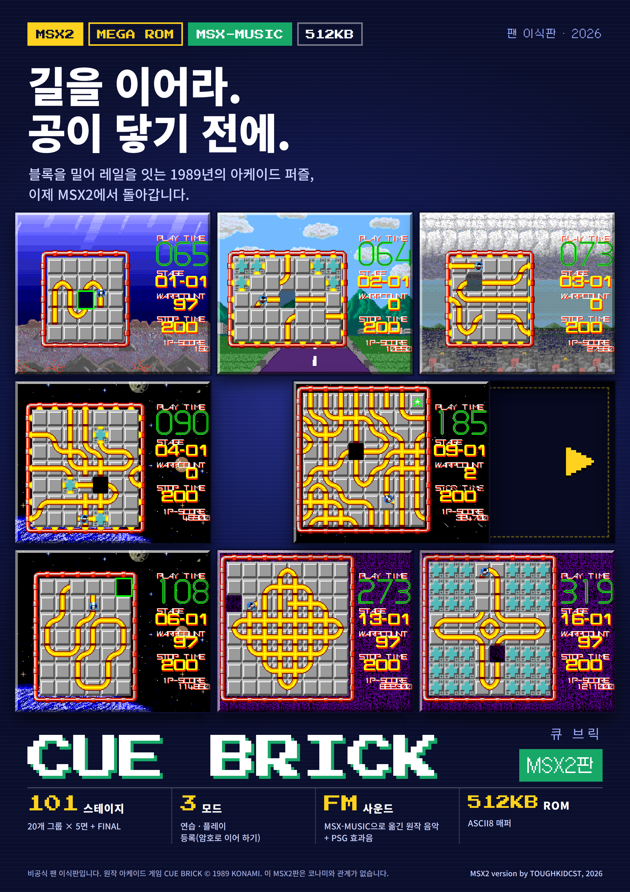
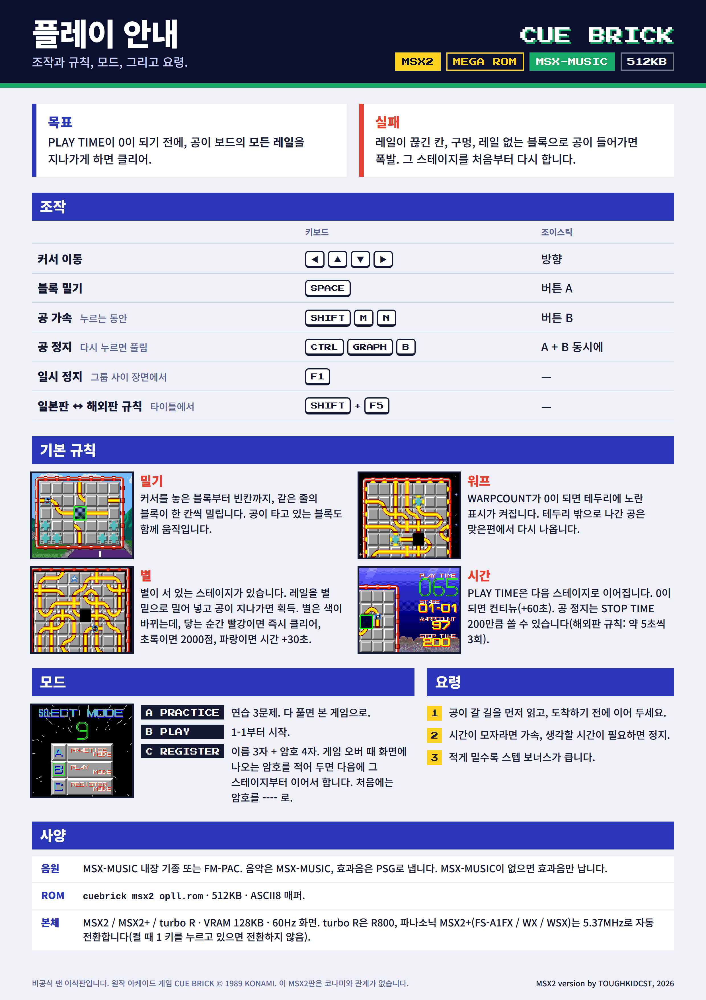

# 큐브릭 MSX2판 사용설명서 — MSX-MUSIC

2026-10-05 · ToughkidCST

## 이 게임에 대하여

큐브릭(CUE BRICK)은 블록을 밀어 길(레일)을 잇고, 공이 보드의 모든 길을 지나가게 하는 퍼즐입니다. 이 ROM은 1989년 아케이드 게임을 MSX2로 옮긴 비공식 팬 이식판입니다.

이 설명서는 **MSX-MUSIC 512KB판**(`cuebrick_msx2_opll.rom`)을 다룹니다.

- 101 스테이지: 20개 그룹 × 5면 + FINAL
- 모드 세 가지: 연습, 플레이, 등록(암호로 이어 하기)
- 음악은 MSX-MUSIC(FM), 효과음은 PSG
- 512KB ROM 하나에 전부 들어 있어, 512KB까지만 지원하는 플래시 카트에서도 돌아갑니다

원작 아케이드 게임 CUE BRICK © 1989 KONAMI. 이 MSX2판은 코나미와 관계가 없습니다.

## 동작 환경과 ROM

MSX2, MSX2+, turbo R에서 돌아갑니다. VRAM 128KB와 60Hz를 받는 화면이 필요합니다.

| 항목 | 내용 |
| --- | --- |
| ROM 파일 | `cuebrick_msx2_opll.rom` |
| 크기 | 512KB (8KB 뱅크 64개) |
| 매퍼 | ASCII8 |
| 음악 | MSX-MUSIC — 본체 내장 또는 FM-PAC |
| 효과음 | 본체 PSG |

MSX-MUSIC이 없으면 음악 없이 효과음만 납니다. 게임은 그대로 할 수 있습니다.

## 실행하기

ROM을 플래시 카트나 에뮬레이터에 올리고 매퍼를 **ASCII8**로 맞추면 바로 시작합니다.

- 매퍼를 자동으로 고르지 못하는 플래시 카트나 에뮬레이터에서는 ASCII8을 직접 지정하세요.
- MSX-MUSIC이 내장된 기종(MSX2+, turbo R 등)은 그대로 음악이 납니다.
- MSX-MUSIC이 내장되지 않은 MSX2에서는 FM-PAC을 다른 슬롯에 꽂습니다.

켤 때 기종을 보고 CPU를 가장 빠른 모드로 바꿉니다. turbo R은 R800, 파나소닉 MSX2+(FS-A1FX / WX / WSX)는 5.37MHz입니다. 게임 속도는 같고 화면을 준비하는 시간만 줄어듭니다. 켤 때 **1** 키를 누르고 있으면 바꾸지 않습니다.

## 게임 시작과 모드

전원을 켜면 로고에 이어 타이틀 화면이 나옵니다. **SPACE**(또는 조이스틱 A 버튼)를 누르면 SELECT MODE 화면으로 넘어갑니다. 타이틀에서 10초쯤 그대로 두면 데모 플레이와 우주 장면이 번갈아 나오고, 그동안 SPACE를 누르면 타이틀로 돌아옵니다.

### SELECT MODE

커서는 처음에 B에 놓여 있습니다. 위·아래로 고르고 SPACE로 정합니다. 화면의 숫자가 9에서 0까지 내려가면 커서가 놓인 모드로 시작합니다.

| 모드 | 내용 |
| --- | --- |
| A PRACTICE | 연습용 세 판(00-01 \~ 00-03)을 풉니다. PLAY TIME은 30초이고, 실패하면 같은 판을 다시 합니다. 세 판을 다 풀거나 시간이 다 되면 도입 장면을 거쳐 본 게임 1-1로 넘어갑니다. |
| B PLAY | 도입 장면에 이어 1-1부터 시작합니다. |
| C REGISTER | 이름과 암호를 넣고 시작합니다. 지난번에 끝난 판부터 이어서 할 수 있습니다. 자세한 내용은 「등록 모드·암호·컨티뉴」를 보세요. |

### 일본판 규칙과 해외판 규칙

아케이드판은 일본판과 해외판의 퍼즐과 규칙이 다릅니다. 이 이식판에는 둘 다 들어 있고, 처음에는 일본판 규칙으로 시작합니다. 타이틀 화면에서 **SHIFT+F5**를 누르면 해외판 규칙으로 바뀌며, 화면 왼쪽 위에 INT가 표시되고 로고가 주황색으로 바뀝니다. 한 번 더 누르면 일본판으로 돌아옵니다.

|  | 일본판(기본) | 해외판(INT) |
| --- | --- | --- |
| 퍼즐 | 일본판 배치 | 해외판 배치 |
| 공 멈춤 | STOP TIME 200. 멈춰 있는 동안만 줄어듭니다 | HALT 3회. 한 번에 약 5초 |
| 시간 초과 뒤 컨티뉴 | HELP — 그 판의 풀이를 보여 준 뒤 같은 판을 처음부터 | 하던 자리에서 그대로 계속 |
| 실패 뒤 다시 할 때 | 보드 색이 회색 → 파랑 → 노랑으로 바뀝니다 | 색이 바뀌지 않습니다 |
| 별 아이템 | 일본판 자리(1그룹부터) | 3그룹부터 |
| 화면 표시 | STOP TIME | HI-SCORE, \[H\]×남은 횟수 |

## 조작

키보드와 조이스틱(포트 1)을 함께 쓸 수 있습니다.

| 동작 | 키보드 | 조이스틱 |
| --- | --- | --- |
| 커서 이동 | 커서 키 | 방향 |
| 블록 밀기 / 결정 | SPACE | A 버튼 |
| 공 빠르게(누르고 있는 동안) | SHIFT, M, N | B 버튼 |
| 공 멈춤 | CTRL, GRAPH, B 또는 SPACE와 M·N·SHIFT를 함께 | A+B 버튼 |
| 일시 정지 | F1 (그룹 사이 장면에서만) | — |
| 규칙 바꾸기(일본판 ↔ 해외판) | SHIFT+F5 (타이틀 화면에서만) | — |
| 컨티뉴 화면에서 YES / NO 고르기 | 좌우 커서 키, SPACE로 결정 | 좌우, A 버튼 |

공 멈춤은 일본판 규칙에서는 누를 때마다 멈춤과 진행이 바뀌고, 해외판 규칙에서는 한 번 누르면 약 5초 동안 멈춥니다.

## 화면 보는 법

왼쪽이 퍼즐 보드, 오른쪽이 정보 표시입니다. 보드에는 길이 그려진 블록과 빈칸(구멍) 하나가 있고, 공이 길을 따라 굴러갑니다.

| 표시 | 뜻 |
| --- | --- |
| PLAY TIME | 남은 시간(초). 판이 바뀌어도 이어지고, 판을 시작할 때마다 조금씩 더해집니다. |
| STAGE | 그룹 번호-판 번호. 01-01은 1그룹의 첫 판입니다. |
| WARPCOUNT | 공이 칸을 하나 지날 때마다 1씩 줄어듭니다. 0이 되면 워프가 열립니다. |
| STOP TIME | 공을 멈춰 둘 수 있는 남은 양(일본판 규칙). |
| 1P-SCORE | 점수. |

해외판 규칙(INT)에서는 STOP TIME 자리에 HI-SCORE가 나오고, 그 아래 \[H\]×숫자로 남은 HALT 횟수가 표시됩니다.

보드 위에서 깜빡이는 초록 테두리가 커서이고, 어두운 칸이 구멍입니다.

## 규칙

### 클리어와 실패

공이 보드의 **모든 길을 한 번씩 지나면** 클리어입니다. 공이 지나간 길은 지워집니다. 마지막 길 조각을 지나는 순간 클리어이므로, 그 뒤에 공이 막힌 칸으로 굴러가도 괜찮습니다.

공이 다음 곳으로 들어가면 실패입니다.

- 길이 이어지지 않는 칸
- 구멍
- 길이 없는 블록

실패하면 공이 터지고 그 판을 처음부터 다시 합니다. 보드와 WARPCOUNT는 처음 상태로 돌아가고 공이 한 단계 느려지지만, PLAY TIME은 돌아오지 않습니다.

### 블록 밀기

커서를 블록에 놓고 SPACE를 누르면, 커서 블록과 구멍 사이에 있는 **같은 줄의 블록 전부**가 구멍 쪽으로 한 칸씩 움직입니다. 커서가 구멍과 같은 가로줄이나 세로줄에 있어야 밀 수 있습니다. 공이 올라타 있는 블록도 밀 수 있고, 그때는 공도 함께 움직입니다. 청록색 판은 고정벽이라 움직이지 않습니다.

### 워프

WARPCOUNT가 0이 되면 보드 테두리와 고정벽에 노란 표시가 나타납니다. 이때부터는 공이 테두리나 고정벽으로 나가면 같은 줄의 반대쪽에서 다시 들어옵니다. 들어오는 칸에 이어지는 길이 없으면 실패이고, WARPCOUNT가 남아 있을 때 테두리로 나가도 실패입니다.

### 시간

PLAY TIME은 60초에서 시작하고, 판을 시작할 때마다 그 판의 길 길이에 맞춰 시간이 더해집니다. 남은 시간은 다음 판으로 넘어갑니다. 10초 아래로 내려가면 경고음이 나고, 0이 되면 TIME OVER와 함께 컨티뉴 화면이 나옵니다.

### 점수

| 항목 | 점수 |
| --- | --- |
| 공이 칸에 들어갈 때마다 | 50 |
| 스텝 보너스(클리어할 때) | 스테이지 번호 × 남은 스텝 × 100. 스텝은 한 번 밀 때마다 1씩 줄어드므로, 적게 밀수록 큽니다 |
| 타임 보너스(클리어할 때) | 남은 시간 × 100 |

### 별 아이템

몇몇 판에는 보드의 한 칸 위에 별이 떠 있습니다. 별은 블록이 아니라 그 자리에 고정되어 있으므로, 길 블록을 별 밑으로 밀어 넣고 공이 그 자리를 지나가게 하면 얻습니다. 별은 색이 계속 바뀌며, **공이 닿는 순간의 색**이 상을 정합니다.

| 색 | 상 |
| --- | --- |
| 빨강 | BONUS CLEAR — 남은 길이 모두 지워져 그 판을 바로 클리어합니다 |
| 초록 | BONUS 2000 — 2000점 |
| 파랑 | TIME +30 — PLAY TIME 30초 추가 |

빨강은 아주 짧게만 나오고 초록이 가장 깁니다.

## 등록 모드·암호·컨티뉴·게임 오버

### 컨티뉴

PLAY TIME이 0이 되면 TIME OVER에 이어 컨티뉴 화면이 나옵니다. 위쪽의 RANKING NO.는 지금까지 온 판으로 매긴 순위입니다.

좌우로 YES / NO를 고르고 SPACE로 정합니다.

- **YES**: PLAY TIME 60초를 받고 계속합니다. STOP TIME(해외판은 HALT 3회)도 다시 채워집니다. 컨티뉴 횟수에는 제한이 없습니다.
- **NO**, 또는 숫자가 9에서 0까지 내려갈 때까지 고르지 않으면 GAME OVER입니다.

일본판 규칙에서는 YES / NO를 고르기 전에 **HELP**가 먼저 나옵니다. 그 판을 푸는 커서 움직임과 블록 밀기를 공 없이 보여 주며, YES를 고르면 같은 판을 처음부터 다시 합니다.

### 등록 모드(C REGISTER)

이름 3자와 암호 4자를 넣습니다. 커서 키로 글자판의 글자를 고르고 SPACE로 입력하며, `<`는 한 글자를 지웁니다.

1. **처음 할 때**: 이름을 넣고 암호는 `----`로 넣습니다. NEW PLAYER가 표시되고 1-1부터 시작합니다.
2. **게임 오버가 되면**: 이름과, 그때 하던 판의 암호가 화면에 나옵니다. 적어 두세요.
3. **다음에 할 때**: 같은 이름과 그 암호를 넣으면 OK - CONTINUE가 표시되고 그 판부터 이어서 합니다. 점수는 0부터, PLAY TIME은 60초부터입니다.

알아 둘 점:

- 암호는 이름과 짝입니다. 이름이 다르면 같은 암호라도 PASSWORD ERROR가 나고, 암호 네 자를 다시 넣게 됩니다.
- 카트리지에는 저장 기능이 없습니다. 암호를 적어 두지 않으면 이어서 할 수 없습니다.
- 암호는 MSX-MUSIC 1MB판이나 SCC판에서 받은 것도 그대로 쓸 수 있습니다.
- 등록 화면은 30초가 지나면 등록 없이 1-1부터 시작합니다.
- 등록 화면에서 **M** 또는 **N**을 누르면 등록을 건너뛰고 바로 1-1부터 시작합니다.

### 게임 오버

PLAYER 1 / GAME OVER가 약 5초 동안 표시된 뒤 타이틀로 돌아갑니다. 1초쯤 지나면 SPACE로 넘길 수 있습니다. 등록하고 했다면 그 뒤에 이름과 암호가 나옵니다.

## 스테이지 구성·그룹 사이 장면·일시 정지

### 스테이지 구성

본 게임은 **20그룹 × 5판 + FINAL = 101판**입니다. STAGE 표시의 앞 숫자가 그룹, 뒤 숫자가 그 그룹 안의 판 번호입니다. 판을 클리어하면 스텝 보너스와 타임 보너스를 계산하고, 블록이 날아와 다음 판의 보드를 이룹니다.

배경은 그룹에 따라 여섯 가지가 나옵니다: 바다, 산과 도시, 구름, 우주와 지구, 심우주, 보라 터널. 바다에서는 상어·가오리·거품이, 우주에서는 우주선이 지나갑니다. 512KB판은 배경이나 장면이 바뀔 때 그림 한 장을 불러오는 데 0.4–0.8초가 걸립니다(기본 속도 기준).

### 그룹 사이 장면

한 그룹의 다섯 판을 모두 풀면 STAGE CLEAR / CHALLENGE / NEXT STAGE 글자와 함께 모아이가 나오는 짧은 장면이 나온 뒤 다음 그룹으로 넘어갑니다. FINAL을 풀면 엔딩이 나옵니다.

### 일시 정지

그룹 사이 장면에서 **F1**을 누르면 게임이 멈춥니다. 짧은 효과음과 함께 화면 가운데에 흰 PAUSE 글자가 깜빡이며, F1을 한 번 더 누르면 이어집니다.

퍼즐을 푸는 도중에는 일시 정지가 없습니다. 자리를 비워야 하면 판을 마친 뒤 그룹 사이 장면에서 멈추세요. 플레이 중에 잠깐 생각할 시간이 필요하면 공 멈춤(STOP TIME / HALT)을 씁니다. 공이 멈춰 있는 동안에도 PLAY TIME은 줄어듭니다.

## 요령

- **길을 먼저 읽으세요.** 공이 어느 칸으로 나갈지 보고, 도착하기 전에 다음 길을 이어 둡니다.
- **공이 곧 들어갈 블록은 밀지 마세요.** 움직이는 중인 블록으로는 공이 들어가지 못해 실패합니다. 블록이 움직이는 동안에는 다음 밀기도 들어가지 않습니다.
- **공이 탄 블록을 밀면 공을 옮길 수 있습니다.** 길이 끊길 것 같을 때 공을 통째로 다른 자리로 데려가는 방법입니다.
- **시간이 모자라면 가속, 생각할 시간이 필요하면 정지.** 길을 다 이어 놓았다면 가속을 누르고 있는 편이 타임 보너스에도, 다음 판에 넘길 시간에도 유리합니다.
- **적게 밀수록 스텝 보너스가 큽니다.** 그룹이 뒤로 갈수록 곱해지는 수도 커집니다.
- **워프를 계산에 넣으세요.** WARPCOUNT가 0이 된 뒤에는 테두리를 건너 반대쪽 길로 이을 수 있어, 막다른 것 같은 판이 풀립니다.
- **별은 색을 보고 들어가세요.** 시간이 급하면 파랑(TIME +30)을, 어려운 판이면 빨강(BONUS CLEAR)을 노립니다. 공 멈춤으로 타이밍을 맞출 수 있습니다.
- **막히면 HELP를 보세요.** 일본판 규칙에서는 시간이 다 됐을 때 그 판의 풀이가 나옵니다.
- **처음이라면 A PRACTICE부터.** 세 판으로 밀기와 가속·정지를 익힌 뒤 본 게임으로 이어집니다.

## 문제가 생겼을 때

| 증상 | 확인할 것 |
| --- | --- |
| 화면이 안 나오거나, 로고 뒤에 멈추거나, 그림이 깨짐 | 매퍼 설정을 확인합니다. 이 ROM은 ASCII8입니다. |
| MSX1에서 실행되지 않음 | MSX2 이상(VRAM 128KB)이 필요합니다. |
| 효과음만 나고 음악이 없음 | 본체에 MSX-MUSIC이 없는 경우입니다. FM-PAC을 다른 슬롯에 꽂습니다. openMSX라면 `-ext fmpac`을 붙이고, ROM을 `-ext`보다 앞에 적습니다. |
| 데모는 도는데 타이틀에서 SPACE가 듣지 않음 | ROM 파일이 손상되었거나 카트에 잘못 쓰였을 수 있습니다. 게임은 켤 때 ROM 전체를 검사해서, 내용이 다르면 입력을 받지 않습니다. ROM을 다시 받아 다시 써 보세요. 파일 크기는 524,288바이트입니다. |
| 화면이 흐르거나 제대로 나오지 않음 | 게임은 화면을 60Hz로 냅니다. 60Hz를 받는 모니터나 TV를 씁니다. |
| turbo R이나 고속 모드가 있는 MSX2+에서 동작이 이상함 | 켤 때 **1** 키를 누르고 있으면 CPU를 빠른 모드로 바꾸지 않고 시작합니다. 예전 ROM에서는 SELECT MODE 화면이 깨지는 문제가 있었으니 최신 ROM인지도 확인하세요. |
| F1을 눌러도 멈추지 않음 | 일시 정지는 그룹 사이 장면에서만 됩니다. |
| 암호를 넣었는데 PASSWORD ERROR | 이름 세 자가 암호를 받을 때와 같은지 확인합니다. 암호는 그 이름에만 맞습니다. |

## 크레딧과 고지

- 원작: 아케이드 게임 CUE BRICK © 1989 KONAMI
- MSX2판: TOUGHKIDCST, 2026

이 MSX2판은 원작을 좋아하는 팬이 취미로 만든 비공식 이식판이며, 코나미와 관계가 없습니다. 게임의 규칙·퍼즐·그림·음악의 권리는 원작 권리자에게 있습니다.

MSX는 MSX Licensing Corporation의 상표입니다. 그 밖의 이름은 각 소유자의 상표입니다.
